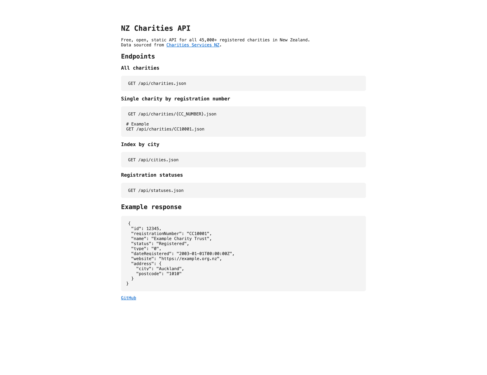

# New Zealand Charities & Grants — Free Public API

The most complete, free, open database of New Zealand charities and grants.

Whether you're looking for a charity to donate to, a grant to apply for, or you're a developer building something for the NZ community sector — this is for you.

- 45,000+ charities — every organisation registered with Charities Services NZ
- Grants coming soon — Creative NZ, Lotteries, Foundation North, and more
- Completely free — no account, no API key, no cost, ever
- Always up to date — refreshed directly from the official NZ government register

## [→ Visit the live site](https://amateurbeekeeper.github.io/nz-charities-and-grants-api)

## [→ Browse the full charities dataset](https://amateurbeekeeper.github.io/nz-charities-and-grants-api/api/charities.json)

---



---

## Who is this for?

### Individuals

Looking for a cause to support? Search 45,000+ registered New Zealand charities by name, city, or what they do. Find contact details, websites, and more.

### Grant seekers

Trying to find funding for your project or organisation? We're building a searchable database of every major NZ grant — who can apply, how much, and when applications close.

### Developers and researchers

Building an app, doing research, or working with NZ charity data? Use our free REST API — no sign-up required. Just fetch JSON.

### AI and data tools

Every endpoint is designed to be easily readable by AI models and data pipelines. Full schema documentation and an `llms.txt` coming soon.

---

## What data is included?

Each charity record includes:

| Field | Description |
| --- | --- |
| Registration number | Unique CC number assigned by Charities Services |
| Name | Legal name of the organisation |
| Status | Whether currently registered or deregistered |
| Address | Street, suburb, city, postcode |
| Website | Official website if available |
| Financial year end | When their financial year closes |
| Kaupapa Māori | Whether the charity identifies as Kaupapa Māori |
| Pasifika | Whether the charity identifies as Pasifika |
| Date registered | When they first registered |
| NZBN | New Zealand Business Number |

---

## API Endpoints

Base URL: `https://amateurbeekeeper.github.io/nz-charities-and-grants-api`

### All charities

```
GET /api/charities.json
```

Returns all 45,000+ charities as a JSON array.

**[→ Try it in your browser](https://amateurbeekeeper.github.io/nz-charities-and-grants-api/api/charities.json)**

### Single charity by registration number

```
GET /api/charities/CC10001.json
```

Returns one charity record by its CC number.

**[→ See an example record](https://amateurbeekeeper.github.io/nz-charities-and-grants-api/api/charities/CC10001.json)**

### Browse by city

```
GET /api/cities.json
```

Returns all cities with a count of charities in each.

**[→ Try it](https://amateurbeekeeper.github.io/nz-charities-and-grants-api/api/cities.json)**

### Registration status breakdown

```
GET /api/statuses.json
```

**[→ Try it](https://amateurbeekeeper.github.io/nz-charities-and-grants-api/api/statuses.json)**

---

## Code examples

### JavaScript — find charities in a city

```js
const res = await fetch('https://amateurbeekeeper.github.io/nz-charities-and-grants-api/api/charities.json')
const { charities } = await res.json()

const christchurch = charities.filter(c => c.address.city === 'Christchurch')
console.log(`${christchurch.length} charities in Christchurch`)
```

### JavaScript — look up a specific charity

```js
const res = await fetch('https://amateurbeekeeper.github.io/nz-charities-and-grants-api/api/charities/CC10001.json')
const charity = await res.json()
console.log(charity.name, charity.website)
```

---

## Coming soon

- **Grants database** — every major NZ grant, searchable by region and eligibility
- **Donation finder** — a simple interface to find a charity to donate to
- **Grant finder** — filter open grants by who can apply
- **AI chat** — ask questions about the data in plain English
- **Community corrections** — suggest updates to charity records

[View all planned features →](https://github.com/amateurbeekeeper/nz-charities-and-grants-api/issues)

---

## Refreshing the data

The data is fetched directly from the [Charities Services NZ OData API](https://www.charities.govt.nz/charities-in-new-zealand/the-charities-register/open-data/) and transformed into clean JSON.

```bash
npm install
npm run fetch
git add api/
git commit -m "Refresh data"
git push
```

GitHub Pages deploys automatically on push.

---

## Data source and licence

Data sourced from the [New Zealand Charities Register](https://www.charities.govt.nz), maintained by Charities Services — a business unit of Te Tari Taiwhenua, Department of Internal Affairs.

Published under the [Creative Commons Attribution 4.0](https://creativecommons.org/licenses/by/4.0/) licence.

---

## Contributing

Found an error? Want to add a feature? Open an issue or PR — contributions are welcome.

[View open issues →](https://github.com/amateurbeekeeper/nz-charities-and-grants-api/issues)
